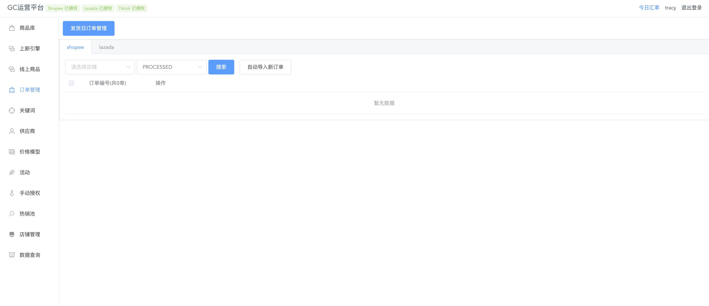
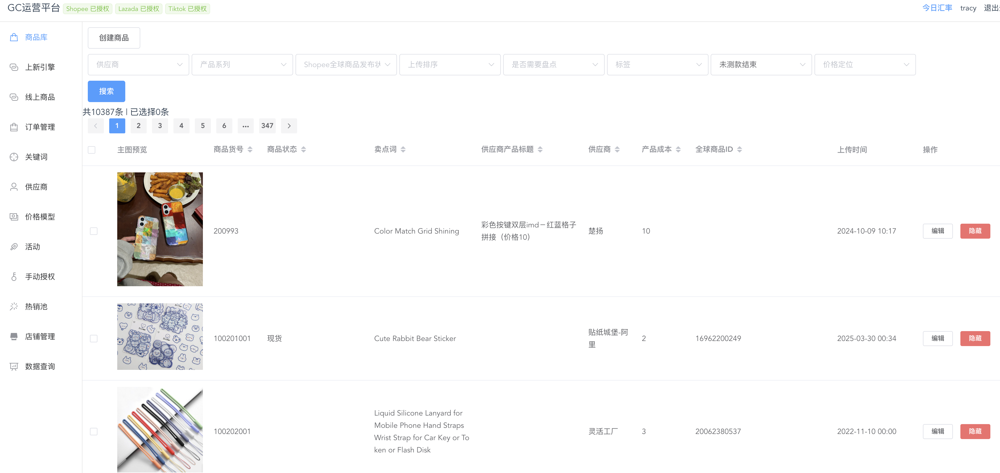

# E-commerce ERP 

[](https://github.com/freedomcly/ecommerce-erp/blob/main/LICENSE)


Cross-border e-commerce ERP solution for multi-platform sellers

🇬🇧 English | [🇨🇳 中文版](#chinese-version)

## 🛠️ Supported Platforms
- ✅ Shopee 
- ✅ Lazada 
- ✅ TikTok
- ✅ Coupang

## 🚀 Key Features
- 🌐 **Unified API Integration** - Streamline product upload and order processing across platforms
- 🗃️ **Centralized Product Management** - CRUD operations with version control
- 📦 **Automated Procurement** - Auto-merge orders into standardized purchase lists
- 🧮 **Financial Settlement** - Automated calculation of cross-border fees (shipping/taxes/platform charges)
- 🚀 **Campaign Automation** - Platform marketing event integration for traffic growth




## 🚦 Quick Start

### Prerequisites
- Node.js 6+
- MongoDB 3+

### Installation
```bash
# Clone repository
git clone

# Install backend dependencies
cd backend && npm install

# Install frontend dependencies
cd ../frontend && npm install
```

### Running
```bash
# Start backend service (from project root)
cd backend && npm run dev

# Start frontend service (from project root)
cd ../frontend && npm start
```

## ⚙️ Configuration
Create platform config files under `backend/configs/`:

```
├── configs/
│   ├── shopee.js
│   ├── lazada.js
│   ├── tiktok.js
│   ├── coupang.js
│   └── mongodb.js
```

💡 **Tip**: Copy `example.config.js` as template and fill your credentials

---

<a id="chinese-version"></a >
# 跨境电商ERP系统

[](https://github.com/freedomcly/ecommerce-erp/blob/main/LICENSE)


为多平台卖家打造的跨境电商ERP解决方案

## 🛠️ 已对接平台
- ✅ Shopee 
- ✅ Lazada 
- ✅ TikTok
- ✅ Coupang

## 🚀 核心功能
- 🌐 **多平台接口整合** - 商品上传、订单处理等操作一站式管理
- 🗃️ **智能商品库** - 支持商品信息的增删改查及版本管理
- 📦 **自动化采购** - 多平台订单自动合并生成标准采购单
- 🧮 **财务结算** - 多国运费/税费/平台费自动核算
- 🚀 **营销自动化** - 平台活动自动报名与流量运营

## 🚦 快速开始

### 环境要求
- Node.js 6+
- MongoDB 3+

### 安装步骤
```bash
# 克隆仓库
git clone

# 安装后端依赖
cd backend && npm install

# 安装前端依赖
cd ../frontend && npm install
```

### 启动服务
```bash
# 启动后端服务（项目根目录执行）
cd backend && npm run dev

# 启动前端服务（项目根目录执行）
cd ../frontend && npm start
```

## ⚙️ 配置说明
在 `backend/configs/` 目录下创建平台配置文件：

```
├── configs/
│   ├── shopee.js
│   ├── lazada.js
│   ├── tiktok.js
│   ├── coupang.js
│   └── mongodb.js
```

💡 **提示**：可复制 `example.config.js` 为模板填写认证信息

## License
MIT © 2023 [freedomcly](https://github.com/freedomcly)
```
